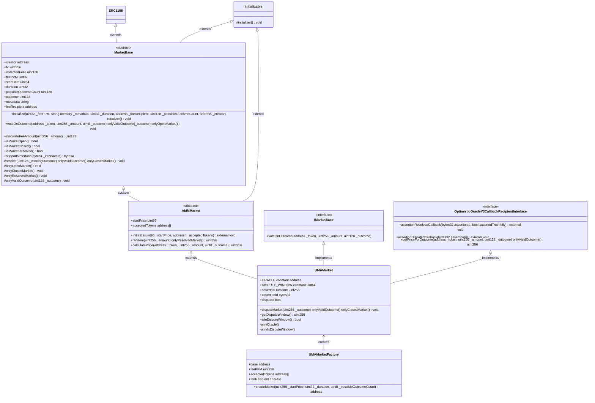

# Savant Core

The repo holds the smart contracts that make the Savant markets work.

## Structure

```mermaid
classDiagram
    class Initializable {
        #initializer() void
    }

    class ERC1155 {
    }

    class IMarketBase {
        <<interface>>
        +voteOnOutcome(address _token, uint256 _amount, uint128 _outcome)
    }

    class MarketBase {
        <<abstract>>
        +creator address 
        +tvl uint256
        +collectedFees uint128
        +feePPM uint32
        +startDate uint64
        +duration uint32
        +possibleOutcomeCount uint128
        +outcome uint128
        +metadata string 
        +feeRecipient address

        +initialize(uint32 _feePPM, string memory _metadata, uint32 _duration, address _feeRecipient, uint128 _possibleOutcomeCount, address _creator) initializer() void
        +voteOnOutcome(address _token, uint256 _amount, uint8 _outcome) onlyValidOutcome(_outcome) onlyOpenMarket() void
        +calculateFeeAmount(uint256 _amount) uint128
        +isMarketOpen() bool
        +isMarketClosed() bool
        +isMarketResolved() bool
        +supportsInterface(bytes4 _interfaceId) bytes4

        #resolve(uint128 _winningOutcome) onlyValidOutcome() onlyClosedMarket() void

        #onlyOpenMarket() void
        #onlyClosedMarket() void
        #onlyResolvedMarket() void
        #onlyValidOutcome(uint128 _outcome) void
    }

    class AMMMarket {
        <<abstract>>
        +startPrice uint96
        +acceptedTokens address[]

        +initialize(uint96 _startPrice, address[] _acceptedTokens) external void
        +redeem(uint256 _amount) onlyResolvedMarket() uint256
        +calculatePrice(address _token, uint256 _amount, uint8 _outcome) uint256
    }

    class OptimisticOracleV3CallbackRecipientInterface {
        <<interface>>
        +assertionResolvedCallback(bytes32 assertionId, bool assertedTruthfully) external void
        +assertionDisputedCallback(bytes32 assertionId) external void
        +getPriceForOutcome(address _token, uint256 _amount, uint128 _outcome) onlyValidOutcome() uint256
    }

    class UMAMarket {
        +ORACLE constant address
        +DISPUTE_WINDOW constant uint64
        +assertedOutcome uint256
        +assertionId bytes32
        +disputed bool

        +disputeMarket(uint256 _outcome) onlyValidOutcome() onlyClosedMarket() void
        +getDisputeWindow() uint256
        +isInDisputeWindow() bool

        -onlyOracle()
        -onlyInDisputeWindow()
    }

    class UMAMarketFactory {
        +base address
        +feePPM uint256
        +acceptedTokens address[]
        +feeRecipient address

        +createMarket(uint256 _startPrice, uint32 _duration, uint8 _possibleOutcomeCount) address
    }

    ERC1155 <|-- MarketBase: extends
    Initializable <|-- MarketBase: extends

    MarketBase <|-- AMMMarket: extends
    Initializable <|-- AMMMarket: extends

    AMMMarket <|-- UMAMarket: extends
    IMarketBase <|-- UMAMarket: implements
    OptimisticOracleV3CallbackRecipientInterface <|-- UMAMarket: implements

    UMAMarket <.. UMAMarketFactory: creates
```